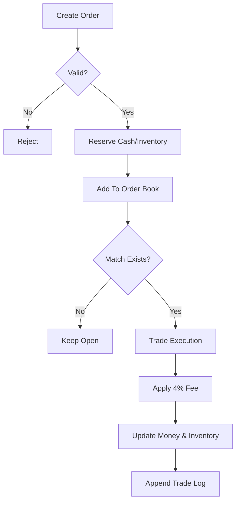
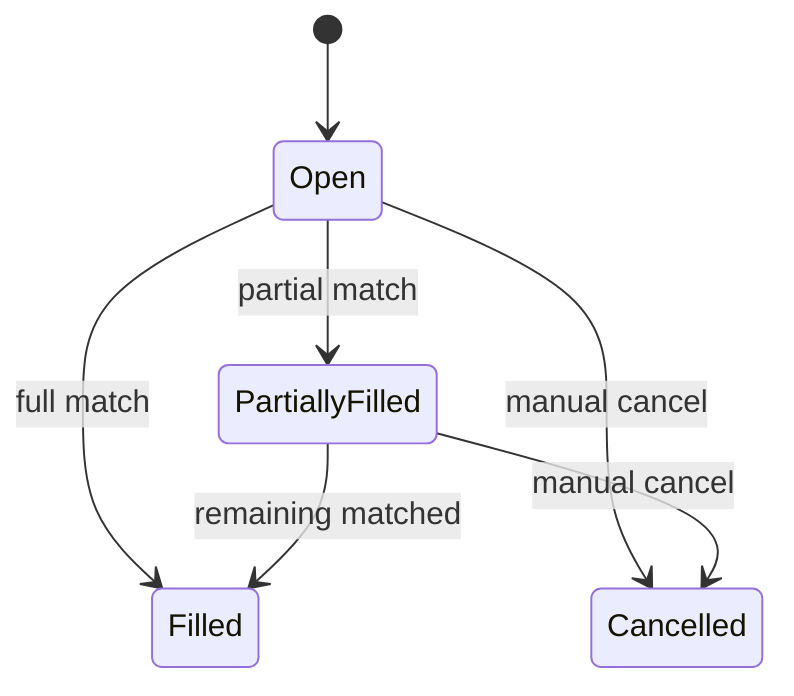

# 经济系统运行逻辑（反推版）

## 1) 数据层

系统由两类数据驱动：

1. 静态参数（反编译得到）  
   - `resources.json`：资源定义、运输、产量等  
   - `buildings.json`：建筑定义与产出链  
   - `economy_model.json`：经济状态 0/1/2 下成本、产能、销量模型
2. 动态状态（服务内存态）  
   - 公司现金、库存、订单簿、成交记录、建筑运行状态

## 2) 主循环

1. 玩家下单（买/卖）  
2. 校验（余额/库存/参数）  
3. 资金或库存预扣  
4. 订单进入订单簿  
5. 撮合引擎按价格优先撮合  
6. 成交时收取手续费并更新现金与库存  
7. 写入成交流水（trade）

## 3) 核心公式

- 订单总额：`total = quantity * price`
- 市场手续费：`fee = ceil(quantity * price * 0.04)`
- 实际买入成本：`cost = total + fee`
- 买单成交条件：`sell.price <= buy.maxPrice`

## 4) 经济状态对产销的含义

`economy_model.json` 里每个资源在三个状态下都定义了：

- `buildingLevelsNeededPerUnitPerHour`：单位产出所需建筑等级密度
- `modeledProductionCostPerUnit`：单位生产成本
- `modeledStoreWages`：零售工资基线
- `modeledUnitsSoldAnHour`：每小时销量模型

这意味着“周期状态”本质上会影响两条线：

1. 供给线（产能成本）  
2. 需求线（门店销量/工资压力）

## 5) 流程图

## 6) 状态图（简化）

## 7) 公式实现映射（Go）

- 市场 Tick 与手续费：
  - `internal/formula/market.go`
  - 已实现：价格档位、Tick 校验、`fee = ceil(amount * price * rate)`
- 生产核心：
  - `internal/formula/production.go`
  - 已实现：`B6t` 薪资修正、`$6t` 产速核心、机器人加成、单位产时
- 零售模型：
  - `internal/formula/retail.go`
  - 已实现：`kle/J7r` 结构化版本（售价-销量-饱和度-天气联动）
- 债券公式：
  - `internal/formula/bonds.go`
  - 已实现：面值、日息、期间利息、最大可发行量

当前接口已接入公式的关键点：
- 市场挂单会做 Tick 校验（不合法价格直接拒绝）
- 吃单成交时按 4% 手续费模型结算
- 债券接口返回日息和期间利息派生值
- 行政开销接口接入 COO 技能折减公式
- 政府合同接口接入投标保证金、最低价授标、交付结算
- 零售调试接口接入季节饱和度与天气倍率联合影响
