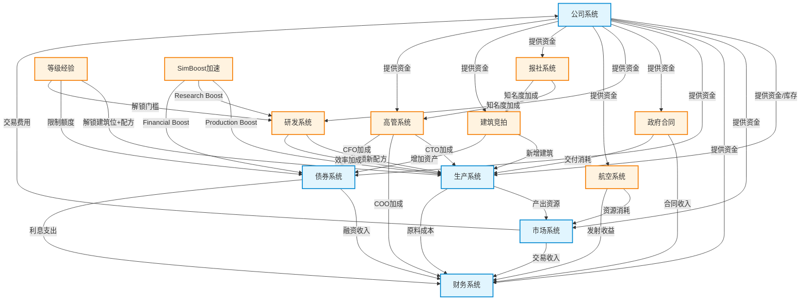

# Go Sim API - 需求规格说明书

> 版本 1.0 | 最后更新 2026-06-01
>
> 本文档定义 Go Sim API 项目的完整需求：每个模块的游戏性设计、模块间的交互关系、核心规则与公式、以及验收标准。目标受众包括后续开发者和系统设计者。

---

## 1. 游戏定位

### 1.1 游戏概述

这是一款**经济模拟经营**（Economic Simulation / Tycoon）游戏。玩家扮演一家公司的首席执行官（CEO），在模拟市场经济环境中通过资源生产、市场交易、债券金融、政府合同、高管管理、科技研发等多种方式经营公司，逐步扩大企业规模。

游戏的核心驱动力是**生产-交易-扩张**循环。玩家从基础资源开始，通过建筑将低级资源加工为高级资源，通过交易所出售产品获利，用利润扩大生产线、招募人才、研发新技术，最终形成正向增长飞轮。

### 1.2 核心循环

```
资金 → 购买原材料 → 生产加工 → 市场销售 → 获利
  ↑                                                │
  │                                                ↓
  └──────── 扩大生产规模 ← 升级解锁 ← 更多策略 ←──┘
```

每一轮循环的收益决定下一轮的增长速度。玩家需要持续优化：

1. **生产效率**：选择正确的生产配方、配置高管加成的技能、升级解锁高级配方
2. **市场策略**：选择合适的出售时机和价格，利用市场价差套利
3. **融资能力**：通过债券和合同获得额外资金，扩大生产规模
4. **研发投入**：解锁新技术、降低原料消耗、提升整体效率
5. **风险管理**：平衡资产负债率、管理合同交付期限、应对火箭发射失败

### 1.3 核心经济原则

- **完全市场经济**：所有资源价格由订单簿供需决定，系统不干预价格（仅通过机器人提供基础流动性）
- **真实生产链**：151种资源形成有向无环的生产树（DAG），从 Level 1 基础资源到 Level 4+ 高级产品
- **多维度竞争**：价格竞争、效率竞争、规模竞争、人才竞争并存
- **技能加成**：高管技能和玩家等级构成效率乘数，决定竞争位次
- **长期规划**：研发、合同、债券、火箭项目均需要提前规划和资源预留

---

## 2. 模块定义

### 2.1 公司系统

#### 目的

公司是玩家的核心实体。所有经济活动围绕公司展开：公司拥有资金、库存、等级、建筑位等属性，完成生产、交易、金融等所有操作。

#### 用户目标

- 了解公司当前的经营状况（资金、库存、等级）
- 查看和管理已放置的建筑
- 查看和修改公司偏好设置
- 通过持续经营提升公司等级，解锁更多功能

#### 游戏性

公司是玩家的"角色"。等级是衡量公司实力的核心指标，决定了解锁内容和能力上限。玩家需要平衡资金流动性（现金）和库存结构，避免资金链断裂。

等级提升带来阶段性质变：

- 每升 1 级：获得 1 点技能点（可投资于高管培养）
- 每 5 级：解锁 1 个新的建筑位
- 每 10 级：解锁 1 个高级生产配方
- 等级同时线性影响生产效率：每级生产速度 +2%

#### 依赖

- 无外部依赖（公司是玩家入口实体）

#### 被依赖

- 所有模块均依赖公司系统（资金扣除/库存增减）

#### 核心规则

1. **初始资金**：由配置项 `SIM_API_START_MONEY` 决定（默认 200,000）
2. **初始等级**：由配置项 `SIM_API_START_LEVEL` 决定（默认 42）
3. **资金约束**：所有需要资金的操作必须校验 `money ≥ 0`
4. **库存约束**：消耗资源时检查库存充足，不足则拒绝操作
5. **等级上限**：60 级封顶
6. **建筑位**：基础建筑位 = 1，每 5 级 + 1
7. **等级对生产效率的加成**：`productionSpeedMultiplier = 1 + level × 0.02`
8. **并发控制**：所有变更通过 `sync.Mutex` 序列化

#### 交互流程

```
玩家请求 → HTTP Handler → Service(mu.Lock)
  → 校验资金/库存 → 执行业务逻辑 → 更新状态
  → 记录流水账 → mu.Unlock → 返回响应
```

**关键端点**：

| 方法 | 路径 | 功能 |
|------|------|------|
| GET | `/api/v3/companies/{id}/` | 公司详情 |
| GET | `/api/v2/companies/me/buildings/` | 已放置建筑列表 |
| GET | `/api/v2/players/me/companies/` | 玩家公司列表 |
| GET | `/api/v2/companies/me/game-notifications/` | 游戏通知 |
| GET | `/api/v2/companies/me/market-orders/` | 公司挂单 |

---

### 2.2 资源系统

#### 目的

定义游戏中所有可交易和可生产的物品。资源系统是经济的基础数据层，151 种资源通过配方形成生产树，每种资源有独立的供需参数、季节属性和经济模型。

#### 用户目标

- 查询任意资源的定义和属性
- 了解资源的配方（输入/输出）
- 查看资源的市场价格和历史走势
- 了解资源的季节性特征和衰减属性

#### 游戏性

资源系统构成完整的生产树（DAG）：

- **Level 1**（基础/原材料）：电力（ID:1）、水（ID:2）、种子（ID:66）、木材（ID:67）等——不依赖其他资源，可直接采集/购买
- **Level 2**（初级农产品/基础加工品）：苹果（ID:3）、小麦（ID:4）、牛肉（ID:8）、钢铁（ID:20）等——消耗 1~2 种 Level 1 资源
- **Level 3**（加工品）：面粉（ID:5）、牛排（ID:9）、面包（ID:10）、机械（ID:21）等——需要 Level 2 资源作为原料
- **Level 4**（高级加工品）：蛋糕（ID:11）、披萨（ID:12）、高级机械等——需要 Level 3 级别以上的原料

资源分类（按`resources.json`的 `_resourceArrays`）：

| 分组 | 数量 | 典型资源 |
|------|------|---------|
| 农业（UP） | 13 | 苹果、小麦、牛肉 |
| 食品饮料（OP） | 27 | 面包、蛋糕、披萨、牛排 |
| 建筑（IP） | 11 | 砖、水泥、钢材 |
| 时尚（MP） | 10 | 布料、服装 |
| 能源（RP） | 7 | 电力、原油、汽油 |
| 电子（NP） | 12 | 芯片、电路板 |
| 汽车（DP） | 12 | 发动机、轮胎 |
| 航空（LP） | 20 | 火箭燃料、导航仪 |
| 原材料（FP） | 16 | 铁矿石、沙子、粘土 |
| 研发（jP） | 12 | 研究数据、蓝图 |

#### 依赖

- 无（数据从静态 JSON 加载）

#### 被依赖

- 生产系统：配方定义决定了生产消耗和产出
- 市场系统：资源 ID 是交易标的物
- 航空系统：火箭项目消耗具体资源
- 研发系统：研发项目消耗特定资源
- 财务系统：库存估值基于资源价格

#### 核心规则

1. **资源 ID 唯一**：`dbLetter` 字段为整数主键（1~151）
2. **可交易性**：`isExchangeTradable` 为 true 的资源才能在市场挂单
3. **零售属性**：`unitsSoldAnHour > 0` 表示该资源可零售
4. **季节性**：`productionSeason` / `retailSeason` 影响生产和销售效率的季节波动
5. **衰减**：`decay > 0` 的资源（如冰淇淋 153/154）会随时间减少库存
6. **运输成本**：`transportation` 定义单位运输费用，影响利润估算
7. **经济模型**：`hasEconomyModel=true` 的资源有独立的供需参数

#### 交互流程

```
GET /api/v3/resources/{id}/
  → 从 StaticData.Resources 查找 dbLetter 匹配
  → 返回资源定义（名称、基础价格、配方、属性）
```

---

### 2.3 生产系统

#### 目的

生产系统是游戏的核心玩法。玩家通过建筑消耗输入资源，经过一段生产时间后产出目标资源。生产效率和配方的选择直接影响玩家的盈利能力。

#### 用户目标

- 选择配方开工生产：指定资源和数量，系统扣除原料并开始计时
- 查看生产任务列表：了解哪些任务正在进行、哪些已完成待收货
- 收货：生产完成后将产出资源加入库存
- 优化生产效率：通过升级、高管加成、研发降低生产时间

#### 游戏性

生产是经济循环的核心环节。玩家需要：

1. 分析市场供需，选择利润最高的产品
2. 确保原料供应稳定（自产或市场采购）
3. 管理生产队列，最大化产能利用率
4. 利用建筑竞拍获得更高性能的建筑
5. 通过 CTO 高管加成和研发提升生产效率

**生产链示例**：

```
电力(1) + 水(2) → 小麦(4) → 面粉(5) → 面包(10)
                                    → 蛋糕(11)
牛肉(8) + 调味料 → 牛排(9)
```

#### 依赖

- 公司系统：消耗和产出公司的资金/库存
- 资源系统：配方定义确定输入输出
- 高管系统（CTO）：影响生产效率
- 研发系统：解锁新配方/提升效率

#### 被依赖

- 市场系统：生产产出可挂单出售
- 财务系统：生产成本记录在流水账
- 等级经验系统：完成生产获得 XP

#### 核心规则

1. **生产启动**：输入库存充足才能启动，启动时立即扣除原料，流水账标记 `production_input`
2. **生产时间公式**：
   ```
   baseTime = 345 × buildingSalaryModifier × size / producedPerHour
   actualTime = baseTime × eventMultiplier
   ```
   其中 `eventMultiplier` 包含 SimBoost 加速（Production Boost 可缩短 50%）
3. **CTO 加成后的生产时间**：
   ```
   effectiveTime = baseTime / (1 + CTO技能 × 0.02) / (1 + 研发加成) / (1 + 等级 × 0.02)
   ```
4. **薪资对产量的影响**：
   ```
   基础产率 = producedPerHourRaw × (345 / SalaryMid[level])^salaryModifier
   ```
5. **状态机**：`running → ready → claimed`
   - `running`：生产中
   - `ready`：生产完成待收货
   - `claimed`：已收货
6. **默认工期**：未指定 `estimatedSecondsToFinish` 时自动计算为 `max(30, amount × 6)` 秒
7. **刷新逻辑**：查询 `/api/v2/production/jobs/` 时自动将超时任务标记为 `ready`

#### 交互流程

```
POST /api/v1/buildings/{id}/busy/
  → 校验原料充足 → 扣原料 → 创建 ProductionJob(状态=running)
  → 等待计时 → 自动标记 ready → 玩家 Claim
  → 产出加入库存 → 流水账 production_output
```

---

### 2.4 市场系统

#### 目的

市场系统提供限价订单簿（Limit Order Book），实现玩家之间的资源交易。价格由供需完全决定，系统提供机器人流动性确保市场正常运行。

#### 用户目标

- 查看任意资源的实时行情（最新成交价、24小时变化）
- 查看订单簿深度（5档买盘/卖盘）
- 创建限价买单或卖单
- 市价吃单快速成交
- 撤消未成交的订单
- 查看历史成交记录

#### 游戏性

市场是经济的"引擎室"。价格信号驱动玩家的生产决策：

- 当某种商品价格高企 → 玩家涌入生产 → 供给增加 → 价格回落
- 玩家需要预判市场趋势，在低价时买入，高价时卖出
- 机器人的存在确保市场始终有基础流动性，但价差（spread）会随波动率变化
- 5 档盘口（Order Book Depth）暴露市场深度，帮助玩家判断短期价格支撑/阻力

#### 依赖

- 公司系统：买家/卖家的资金和库存
- 资源系统：确定交易标的物

#### 被依赖

- 财务系统：交易手续费记录为支出
- 等级经验系统：交易额转化为经验值
- 政府合同：交付可能依赖市场采购

#### 核心规则

1. **订单类型**：限价单（Limit Order）和市价单（Market Order / Take）
2. **价格优先 + 时间优先撮合**：
   - 买单按价格从高到低排序（同价按时间先后）
   - 卖单按价格从低到高排序（同价按时间先后）
   - 成交价以卖单价格为准
3. **手续费**：`fee = ceil(quantity × price × feeRate)`，默认费率 4%
4. **资金预扣**：创建买单时冻结相应资金；卖单不预扣（但必须持有足够库存）
5. **价格 Tick**：价格必须落在合法 Tick 步长上，不合法价格直接拒绝
6. **5 档盘口（Depth）**：
   - 买单：聚合最高 5 个不同价格的买单（买1～买5），显示价格+总量
   - 卖单：聚合最低 5 个不同价格的卖单（卖1～卖5），显示价格+总量
   - 暴露为 `GET /api/v3/market/{resource}/{quality}/depth/`
7. **机器人流动性**：
   - 按小时周期模拟供需波动：`cycleVol = 1.0 + BotCycleAmplitude × sin(hour/24 × 2π)`
   - 覆盖资源 8~12（牛肉、牛排、面包、蛋糕、披萨）
   - 双向挂单，价差 5%~15%（随波动率调整）
   - 订单总数上限 `MaxBotOrders`（默认 600）
8. **资金结算**：
   - 买单成交：买家获得资源，卖家获得资金扣除手续费
   - 卖单成交：卖家获得资金扣除手续费，买家获得资源

#### 交互流程

```
CreateOrder
  校验 → 预扣资金/库存 → 入订单簿
  → matchLimitOrders (按价格优先撮合)
  → 部分成交→更新Remaining；完全成交→移除
  → 记录Trade → 更新资金/库存

取Depth
  → 按resourceId+quality过滤 → 分组聚合价格
  → 返回买x5/卖x5

BotMarketCycle
  → 每TICK触发 → 机器人双向挂单 → 清理过期订单 → 控制总数上限
```

---

### 2.5 财务系统

#### 目的

提供完整的财务报表系统，从流水账（Ledger）实时汇总生成三大报表，让玩家清晰了解公司的经营状况和财务健康度。

#### 用户目标

- 查看利润表：了解总收入、总支出和净利润
- 查看资产负债表：了解资产、负债和所有者权益
- 查看现金流量表：了解经营/投资/筹资三类现金流
- 查看最近资金流水：逐笔追溯资金变动

#### 游戏性

财务系统提供"经营成绩单"。玩家通过财务报表判断经营策略的有效性：

- 利润表中的运营支出包括：行政开销（受 COO 技能降低）、生产原料成本、交易手续费
- 资产负债表中的负债率影响债券评级和融资能力
- 持续亏损会消耗净资产，最终导致资金链断裂

**报表间关系**：

```
流水账(每笔交易) → 利润表(收入-支出=净利润)
                 → 资产负债表(资产=现金+库存估值+债券-负债)
                 → 现金流量表(经营+投资+筹资=净现金流)
```

#### 依赖

- 公司系统：资金和库存
- 市场系统：交易手续费
- 债券系统：债券发行/利息影响负债和筹资现金流
- 生产系统：原料成本计入运营支出
- 政府合同：合同收入计入营业收入

#### 被依赖

- 高管系统：COO 技能影响行政开销金额

#### 核心规则

1. **利润表**：
   - 收入（revenue）：所有 `direction=in` 的流水汇总（市场销售、合同收入、债券融资等）
   - 支出（expenses）：所有 `direction=out` 的流水汇总（原料采购、手续费、行政开销等）
   - 净利润（netIncome）= 收入 - 支出
2. **资产负债表**：
   - 资产（assets）= `money + Σ(inventory[qty] × 10) + 持有债券面值`
   - 负债（liabilities）= `Σ(发行债券数量 × BondFaceValue)`
   - 权益（equity）= 资产 - 负债
3. **现金流量表**：
   - 经营活动：`production_*`、`market_trade_*` 类流水
   - 筹资活动：`bond_*` 类流水
   - 投资活动：其余流水
4. **行政开销公式**（COO技能影响）：
   ```
   effectiveOverhead = adminOverhead - (adminOverhead - 1) × cooSkill / 100
   ```

#### 交互流程

```
GET /income-statement/
  → 遍历 Ledger → 按 direction 分类汇总 → 返回收入/支出/净利
GET /balance-sheet/
  → 计算现金+库存+债券 → 减负债 → 返回资产负债表
GET /cashflow-statement/
  → 遍历 Ledger → 按 kind 前缀分类 → 返回三类现金流
```

---

### 2.6 债券系统

#### 目的

债券系统提供融资和投资渠道。发行方通过债券获得运营资金，购买方通过持有债券获得利息收入。评级机制约束风险敞口。

#### 用户目标

- 查看债券市场（可购买的债券列表）
- 发行债券（为自己的公司融资）
- 购买他人发行的债券（赚取利息）
- 赎回自己的债券（降低负债率）
- 结算每日利息
- 查看评级变动

#### 游戏性

债券是重要的融资工具，但过度负债会降低评级、提高融资成本：

- 当公司需要大量资金扩张时，发行债券是快速获得现金的方式
- 债券利息形成持续的财务支出，需要确保盈利能力覆盖利息
- 评级系统约束高风险投资者的敞口，形成风险分层
- 逾期违约触发重组，大幅提高利率，形成惩罚机制

#### 依赖

- 公司系统：发行人和购买人的资金
- 建筑竞拍系统：建筑总价值决定可发行上限

#### 被依赖

- 财务系统：债券利息和本金变动进入流水账
- 高管系统：CFO 技能降低债券发行费率

#### 核心规则

1. **面值**：`BondFaceValue = 5000`（可通过环境变量调整）
2. **发行限制**：
   - 可发行上限 = `floor(总建筑价值 / BondFaceValue) - 已发行数量`
   - 等级债券限额 = `等级 × 1000` 面值
3. **利率范围**：`BondMinInterest ~ BondMaxInterest`（默认 0.5% ~ 2.0%），由市场供需动态调整
4. **日利息公式**：
   ```
   dailyInterest = floor(持有数量 × 50 × 利率%)
   ```
5. **评级规则**（基于资产负债率）：
   - 负债/资产 < 30%：AAA
   - 负债/资产 < 50%：A
   - 负债/资产 < 70%：BBB
   - 负债/资产 >= 70%：BB 或以下
6. **违约处理**：
   - 利息逾期超过 3 天 → 自动触发违约重组
   - 重组后利率提高 10 个百分点
   - 评级降至最低级别
7. **评级购买限制**：
   - AAA~AA：最多投入公司现金的 1%
   - A~BBB-：最多投入公司现金的 3%
   - BB+及以下：最多投入公司现金的 5%

#### 交互流程

```
发行债券：
  → 校验可发行上限 → 创建债券记录(状态=active)
  → 发行人收到 amount × faceValue 资金
  → 流水账 bond_issue

购买债券：
  → 校验评级限制和资金 → 扣除资金 → 更新债券持有量
  → 记录买入

利息结算：
  → 遍历活跃债券 → 对每个持有者计算日利息
  → 发行人支付利息 → 持有者收到利息
  → 逾期检测 → 触发违约处理
```

---

### 2.7 政府合同系统

#### 目的

政府发布固定价格长期采购合同，玩家通过投标竞争获得合同，按时交付以获得稳定收入。合同系统提供另一种收益来源和风险维度。

#### 用户目标

- 查看可用政府合同列表
- 对感兴趣的合同投标（提交单位报价）
- 查看授标结果
- 按合同要求交付资源
- 了解违约风险和后果

#### 游戏性

政府合同提供有保障的需求和固定价格，降低市场价格波动的风险。但合同伴随交付义务和违约惩罚：

- 玩家需要确保生产能力足以在截止日期前完成交付
- 最低价中标机制促使玩家优化成本结构以报出更有竞争力的价格
- 押金机制锁定部分资金，影响流动性管理
- 违约的成本高昂，要求玩家诚实评估生产能力

#### 依赖

- 公司系统：押金和交付资金/库存
- 资源系统：合同标的物

#### 被依赖

- 财务系统：合同收入计入利润表
- 等级经验系统：交付合同获得额外 XP

#### 核心规则

1. **投标**：
   - 需缴纳押金：`deposit = quantity × unitPrice × depositRate`（默认 10%）
   - 同一公司可更新报价（覆盖之前的投标）
2. **授标**：
   - 按 `unitPrice` 升序选取最低价投标者
   - 未中标者退还押金 × `GovBidRefundRate`（默认 80%）
3. **交付**：
   - 须在截止日期前完成交付
   - 扣除所需库存，支付 `quantity × unitPrice`
4. **违约**：
   - 每日罚款 5%（从押金中扣除）
   - 累计超过 10 天未交付 → 自动解除合同，没收全部押金
5. **押金退还**：中标者的押金在合同交付后退还

#### 交互流程

```
投标 → 验资金 → 扣押金 → 记录投标报价
授标 → 选最低价 → 退未中标者押金 → 状态变更为 awarded
交付 → 验库存 → 扣库存 → 付款 + 退押金 → 状态 delivered
违约检测 → 逐日罚款 → 累计10天解除 → 罚没押金 → 状态 defaulted
```

---

### 2.8 高管系统

#### 目的

高管为公司提供核心技能加成，是玩家差异化竞争优势的重要来源。通过招募、培训、挖角等方式获取和培养高管。

#### 用户目标

- 搜索可招募的高管列表
- 招募新高管
- 培训现有高管提升技能
- 挖角其他公司的高管
- 查看高管的技能值和加成效果

#### 游戏性

高管是"人力资源"维度的竞争。不同于标准经营游戏的线性解锁，高管系统引入了人才市场竞争：

- 四种高管角色对应不同的加成方向，玩家需要根据公司战略选择合适的高管
- 培训消耗资金和时间，形成长期投资回报
- 挖角需要支付对方补偿金，形成人才溢价
- 高知名度（报社系统）在挖角中有加成优势

**四种高管与加成**：

| 角色 | 技能 | 核心公式 | 效果描述 |
|------|------|---------|---------|
| COO（运营总监） | 运营技能 | `adminOverhead - (adminOverhead-1) × coo/100` | 降低行政开销，技能100时完全消除 |
| CTO（技术总监） | 技术技能 | `(100 + cto×2) / 100` | 提高生产效率，每点技能+2% |
| CFO（财务总监） | 金融技能 | 降低债券发行费率（待实现细节） | 减少融资成本 |
| CMO（市场总监） | 市场技能 | 提高零售销量（待实现） | 增加零售渠道销售能力 |

**技能值计算**（含多高管协同）：

```
rawSum = Σ(exec_skill × positionMultiplier)
  匹配岗位: 1.0 | 学徒: 0.5 | 其他高管: 0.25 | 非高管: 0
effectiveSkill = floor(s5t(rawSum))
  s5t(x): x≤60→x, 60<x≤80→60+(x-60)/2, x>80→70+(x-80)/2
```

#### 依赖

- 公司系统：招募和培训需要消耗资金
- 报社系统：知名度影响挖角成功率

#### 被依赖

- 生产系统：CTO 技能加成生产效率
- 财务系统：COO 技能降低行政开销
- 债券系统：CFO 技能降低发行费率

#### 核心规则

1. **招募**：消耗资金，随机生成高管（技能值在一定范围内浮动）
2. **培训**：消耗资金 + 固定时间，提升指定技能值
3. **挖角**：支付对方公司补偿金（金额与高管技能值正相关），知名度高则成功率提升
4. **多高管叠加**：技能值通过岗位倍率加权求和，经 `s5t` 函数平滑后取整作为有效技能值
5. **匹配岗位乘数最高（1.0）**，非匹配岗位折减

#### 交互流程

```
搜索高管 → 浏览候选列表
招募 → 消耗资金 → 高管加入公司
培训 → 消耗资金+时间 → 技能值提升
挖角 → 支付补偿金 → 概率成功 → 目标高管加入
```

---

### 2.9 报社系统

#### 目的

报社系统提供社交和声誉维度。玩家可以发布文章，影响自身知名度，从而在竞拍和挖角等场景中获得加成。

#### 用户目标

- 查看已发布的文章列表
- 发布新文章（消耗资金）
- 查看发布费用
- 查询特定作者的文章

#### 游戏性

报纸系统补充"软实力"维度。文章不是直接的经济生产活动，但知名度带来间接优势：

- 在建筑竞拍中，高知名度可能获得评分加成（待实现）
- 在挖角高管时，高知名度提升成功率（待实现）
- 发布费用取决于文章长度，形成成本收益权衡
- 文章内容由玩家自定义，形成游戏社区内容

#### 依赖

- 公司系统：发布费用消耗资金

#### 被依赖

- 高管系统：知名度影响挖角
- 建筑竞拍系统（future）：知名度可能影响竞拍

#### 核心规则

1. **发布费用**：费用 = `baseCost + lengthCost × len(content)`，具体参数由 `publishing-costs` 接口定义
2. **阅读数**：每篇文章跟踪 `readCount`，反映文章热度
3. **文章生命周期**：发布时间起永久可见（除非玩家删除）
4. **作者关联**：文章归属作者的 `authorId`，可查询特定作者的全部文章

#### 交互流程

```
发布文章 → 验资金 → 扣费 → 文章入库 → 返回文章详情
查看文章列表 → 分页查询 → 按时间倒序 → 返回文章列表
```

---

### 2.10 研发系统

#### 目的

研发系统提供长期技术进步的路径。玩家投入资源、资金和时间完成研发项目，解锁新配方、提高生产效率或降低原料消耗。

#### 用户目标

- 查看所有可研发项目（含状态和前置条件）
- 启动研发项目
- 查看研发进度
- 完成研发项目（消耗剩余资源）

#### 游戏性

研发是"长线投资"的维度。短期看，研发消耗当前现金流和生产资源；长期看，研发解锁的效率提升和产品线扩展是持续增长的关键：

**研发树三大分支**：

1. **基础研究**：提高生产效率 +5%（每级叠加，多级可累加）
2. **配方研究**：解锁新生产配方（开拓新生产线）
3. **材料研究**：降低原料消耗 10%（成本优势）

研发策略选择：

- 效率路线：优先基础研究和材料研究，在已有产品线上形成成本优势
- 创新路线：优先配方研究，开拓竞争较小的高利润产品
- 平衡路线：混合推进，兼顾成本和产品线宽度

#### 依赖

- 公司系统：消耗资金
- 资源系统：消耗指定研发资源
- 等级系统：某些高级研发需要等级门槛

#### 被依赖

- 生产系统：研发解锁新配方、加成生产速度
- 等级经验系统：完成研发获得 XP

#### 核心规则

1. **研发启动**：必须满足前置条件（已完成的研发、等级门槛）
2. **研发消耗**：特定资源组合 + 资金 + 固定时间
3. **研发完成**：消耗剩余所需资源，永久解锁对应效果
4. **效率加成累加**：已完成的基础研究效果累乘于生产效率
5. **研发状态**：`locked → available → in_progress → completed`
   - `locked`：前置条件未满足
   - `available`：可启动
   - `in_progress`：进行中
   - `completed`：已完成，效果生效
6. **Research Boost 加速**：使用 SimBoost 中的研究加速可将研发时间缩短 50%

#### 交互流程

```
查看研发 → 选择项目 → POST /research/start/
  → 检查前置条件 → 扣启动资源 → 创建研究进度
  → 自动计时 → 进度更新
  → POST /research/complete/
  → 扣完成资源 → 更新研究树状态 → 解锁效果生效
```

---

### 2.11 等级/经验系统

#### 目的

等级/经验系统衡量玩家的整体经营成果，是解锁新功能和能力上限的核心机制。经验值通过各类经济活动累积，等级提升带来实质性能力增长。

#### 用户目标

- 查看当前等级、经验和升级进度
- 了解不同等级解锁的内容
- 查询指定等级的奖励

#### 游戏性

等级是"软硬兼施"的成长系统。它一方面自然累积（正常经营就会升级），另一方面限制了玩家短期内的能力上限，鼓励长期经营：

- **自然累积**：交易、生产、合同交付、研发完成均产生经验值
- **阶段性质变**：每 5 级解锁建筑位、每 10 级解锁高级配方，形成里程碑激励
- **能力天花板**：等级限制了债券发行上限，高等级玩家可以进行更大规模的金融操作

#### 经验来源

| 行为 | 经验值 | 说明 |
|------|--------|------|
| 完成交易 | +1 XP per 1000 元交易额 | 买卖双方各获得 |
| 完成生产 | +10 XP per 生产任务 | 每次收货时发放 |
| 交付合同 | +50 XP | 每份合同交付完成 |
| 完成研发 | +100 XP | 每个研发项目完成 |

#### 依赖

- 公司系统：等级是公司的属性
- 市场系统：交易经验
- 生产系统：生产经验
- 政府合同：交付经验
- 研发系统：研发经验

#### 被依赖

- 所有模块的解锁条件：等级门槛
- 生产系统：等级加成生产速度
- 债券系统：等级限制债券额度

#### 核心规则

1. **升级**：XP 达到阈值自动升级，升级后 XP 回归累计状态
2. **等级上限**：60 级
3. **每级效果**：生产速度 +2%（乘算叠加）
4. **每 5 级**：解锁 1 个建筑位（基础 1 个）
5. **每 10 级**：解锁 1 个高级生产配方
6. **等级债券限额**：`等级 × 1000` 面值
7. **等级标题**：不同等级段对应不同头衔（如 1~10: 创业新手，11~20: 工厂主，等等）

#### 交互流程

```
任何经济活动 → AddXP(xp) → 检查累计 XP 是否达阈值
  → 触发升级 → 更新公司等级 → 应用解锁效果
  → 返回当前等级/经验状态
```

---

### 2.12 SimBoost 加速道具系统

#### 目的

SimBoost 是游戏内加速道具系统，提供短期效率加成。玩家可以在关键时刻使用加速道具，获得短暂的竞争优势。

#### 用户目标

- 查看当前可用 Boost 数量和类型
- 使用（激活）Boost
- 了解所有 Boost 类型的定义和效果

#### 游戏性

SimBoost 引入"关键时刻"策略：

- **生产加速**（Production Boost）：缩短生产时间 50%，持续 30 分钟
  - 使用时机：大批量订单交付前夕、限时合同交付冲刺
- **研究加速**（Research Boost）：缩短研发时间 50%，持续 30 分钟
  - 使用时机：关键研发项目的最后阶段冲刺
- **财务加速**（Financial Boost）：降低债券发行费率 50%
  - 使用时机：大规模债券发行时降低融资成本

Boost 是稀缺资源：每 24 小时恢复 1 个，最多储存 3 个。玩家需要策略性地安排使用时机，最大化收益。

#### 依赖

- 公司系统：关联公司账号
- 生产系统：生产加速影响生产时间
- 研发系统：研究加速影响研发进度

#### 被依赖

- 无

#### 核心规则

1. **恢复规则**：每 24 小时恢复 1 个（不管是否在线）
2. **储存上限**：最多 3 个（超过不恢复）
3. **加速倍率**：Production Boost 和 Research Boost 均为 50% 时间缩短
4. **持续时间**：30 分钟（激活后倒计时）
5. **叠加规则**：同类型 Boost 不可叠加（新激活重置计时）
6. **Boost 类型定义**：由 `GET /api/v2/players/simboosts/` 返回

#### 交互流程

```
查看状态 → GET /simboosts-use/ → 可用数量 + 活跃 Boost 列表
使用 Boost → POST /simboosts-use/
  → 校验可用数量 > 0 → 消耗 1 个 → 激活效果
  → 效果持续期间相关公式应用加速倍率
```

---

### 2.13 建筑竞拍系统

#### 目的

建筑竞拍系统提供稀有建筑/建筑位的获取渠道。玩家通过竞价获得额外建筑，扩大生产能力和债券发行上限。

#### 用户目标

- 查看当前竞拍列表
- 查看单个竞拍的详细信息和当前最高出价
- 参与竞拍出价
- 查看自己的竞拍记录和已获得的建筑

#### 游戏性

建筑竞拍是"扩张速度"的竞争维度：

- 更多建筑 = 更多生产流水线 = 更大产能
- 建筑增加公司的总资产价值，提高债券发行上限
- 竞拍采用公开增价（English Auction）形式，出价需高于当前最高价至少 5%
- 每 48 小时一轮拍卖，形成扩张节奏
- 资源有限的玩家需要在多场拍卖中做出选择

#### 依赖

- 公司系统：出价消耗公司资金

#### 被依赖

- 生产系统：新增建筑位增加生产能力
- 债券系统：建筑总价值影响可发行债券上限

#### 核心规则

1. **拍卖周期**：每 48 小时一轮
2. **出价规则**：出价必须高于当前最高价至少 5%
3. **截止规则**：到达截止时间后最高价者获得建筑
4. **结算规则**：资金立即扣除，建筑立即分配
5. **最低出价**：`minBid` 字段定义起拍价
6. **失败退款**：非最高价的投标在拍卖结束后退还资金
7. **建筑位限制**：玩家等级决定最大建筑位，竞拍获得的建筑不能超过上限

#### 交互流程

```
查看竞拍列表 → GET /auctions/
出价 → 验资金 → 金额 > currentBid × 1.05 → 更新最高价
截止时间到达 → 找最高价 → 扣款 → 分配建筑 → 退其他人资金
```

---

### 2.14 航空系统

#### 目的

航空系统提供雄心勃勃的"大项目"维度。玩家集合大量资源制造并发射火箭，获得巨额收益。高风险高回报是该模块的核心特征。

#### 用户目标

- 查看火箭项目类型（小型/中型/大型）
- 创建火箭制造项目（消耗资源组合）
- 查看可用组件清单
- 执行发射
- 查看发射历史和成功率

#### 游戏性

航空系统是游戏的"终局内容"之一，在大规模经济基础上运作：

- 火箭项目消耗大量资源和资金，需要充分准备
- 成功发射获得大量资金收益，是高级玩家的主要利润来源
- 失败风险带来真正的"赌博"压力，玩家需要权衡是否发射
- 三种级别的火箭对公司的产能提出阶段性挑战

**火箭类型对比**：

| 类型 | 资源种类×数量 | 总消耗估算 | 收益 | 失败概率 | 失败损失 |
|------|-------------|-----------|------|---------|---------|
| 小型（suborbital） | 10 种 × 100 单位 | 约 1000 单位 | 10 万 | 5% | 50%资源 |
| 中型（orbital） | 20 种 × 500 单位 | 约 10000 单位 | 60 万 | 15% | 50%资源 |
| 大型（deep space） | 30 种 × 2000 单位 | 约 60000 单位 | 300 万 | 30% | 50%资源 |

#### 依赖

- 公司系统：消耗资金
- 市场系统：从市场采购火箭所需资源
- 资源系统：火箭配方定义

#### 被依赖

- 财务系统：火箭收益计入利润表

#### 核心规则

1. **项目创建**：选择火箭类型，指定组件/资源投入
2. **消耗规则**：创建项目时即扣除所需资源（或逐步投入）
3. **发射判定**：
   - 随机生成 [0, 1) 均匀分布值
   - 若值 < 失败概率 → 发射失败
   - 失败损失：投入资源的 50% 被销毁
   - 成功：获得对应收益
4. **冷却时间**：发射后需要一定时间才能再次发射（待实现具体参数）
5. **组件系统**：可用组件由 `components` 接口返回

#### 交互流程

```
创建项目 → POST /aerospace/projects/create/
  → 选火箭类型 → 扣启动资源 → 项目进入就绪态
发射 → POST /aerospace/launch/
  → 随机判定 → 成功→获得收益→记录发射
  → 失败→资源损失50%→记录失败
查看历史 → GET /aerospace/launches/
```

---

### 2.15 消息/聊天系统

#### 目的

提供玩家间通信和游戏系统通知功能，以及聊天室社区交互。

#### 用户目标

- 发送和接收私信
- 查看系统通知
- 加入聊天室参与讨论
- 管理员管理聊天室（禁言等）

#### 游戏性

消息系统构建游戏的社交层：

- 私信用于玩家间业务往来（合同商议、高管交易等）
- 系统通知及时告知重要事件（合同到期、债券违约、竞拍结果等）
- 聊天室形成社区讨论空间，增强玩家黏性
- 管理员角色维护聊天秩序

#### 依赖

- 公司系统：消息的发送者/接收者标识

#### 被依赖

- 无

#### 核心规则

1. **私信**：点对点发送，可标记已读
2. **系统通知**：由系统自动生成，推送到玩家通知列表
3. **聊天室**：公开/私有房间，玩家可加入
4. **管理员角色**：
   - 可禁言指定玩家（`mute` 功能）
   - 可删除违规消息
   - 禁言有效期可配置
5. **消息存储**：在内存中存储，支持分页查询

#### 交互流程

```
发送私信 → POST /api/v2/message/
  → 创建消息记录 → 接收者通知列表更新
查看消息 → GET /api/messages/
  → 按发送/接收筛选 → 返回消息列表
聊天室 → GET/POST /api/v2/chatroom/
  → 获取/发送聊天室消息
禁言 → 管理员操作 → 设置禁言标志 → 被禁言玩家无法发言
```

---

## 3. 模块依赖图



---

## 4. 数据流示例

### 场景：从零开始完成一次完整经济循环

假设玩家初始拥有 200,000 资金，选择牛肉→牛排加工作为起手产业链。

```
步骤 1: 登录 → 查看公司面板
  GET /api/v3/companies/{id}/
  → 响应: { money: 200000, level: 1, inventory: {}, buildings: [...] }

步骤 2: 查看牛肉市场行情
  GET /api/v3/market-ticker/8/
  → 响应: { resourceId: 8, last: 10.50, change: 0.30, volume: 50000 }

步骤 3: 查看订单簿深度
  GET /api/v3/market/8/1/depth/
  → 响应: {
      bids: [{price: 9.80, quantity: 200}, {price: 9.70, quantity: 150}, ...],
      asks: [{price: 10.20, quantity: 150}, {price: 10.30, quantity: 200}, ...]
    }
  解读：当前买一 9.80 × 200，卖一 10.20 × 150。合理买入价约 10.00。

步骤 4: 创建限价买单
  POST /api/v2/market-order/  { resourceId:8, kind:1, quality:1, quantity:100, price:10.00 }
  → 资金预扣: 100 × 10.00 = 1000（锁定，不扣手续费）
  → 订单状态: 进入订单簿，等待撮合
  → 此时卖一 10.20 高于 10.00，不立即撮合

步骤 5: 机器人挂出卖单（或另一个玩家卖出）
  假设机器人挂出卖单 price=10.00, quantity=100
  → 撮合引擎扫描: 买单 10.00 ≥ 卖单 10.00 → 成交
  → 成交价 = 10.00（以卖单价格为准）
  → 成交数量 = min(100, 100) = 100
  → 手续费 = ceil(100 × 10.00 × 0.04) = 40
  → 结算:
    - 买家（本玩家）: 获得 100 单位牛肉
    - 买家资金变动: -1000（买入价） + 0（无退款，价差为0） = -1000
    - 流水账: market_trade_buy 1000 out
    - 买家支付手续费计入流水
  → 订单状态变为 Filled，从订单簿移除

步骤 6: 库存中已有牛肉，启动生产
  POST /api/v1/buildings/b-1/busy/  { kind:9, amount:10 }
  → 查找牛肉→牛排配方: 消耗牛肉(8)×2 + 水(2)×1 → 产出牛排(9)×1
  → 校验库存: 牛肉≥20, 水≥10
  → 扣除原料: inventory[8] -= 20, inventory[2] -= 10
  → 计算生产时间:
    baseTime = 345 × salaryModifier × size / producedPerHour
    假设: salaryModifier=1.0, size=1, producedPerHour=100
    baseTime = 345 × 1.0 × 1 / 100 = 3.45 秒
    实际 = 3.45 / (1 + level×0.02) = 3.45 / 1.02 ≈ 3.38 秒
  → 创建 ProductionJob { status: "running", completesAt: "..." }
  → 流水账: production_input 金额 out

步骤 7: 等待生产完成 → 收货
  GET /api/v2/production/jobs/（自动刷新状态）
  → 超时任务标记为 ready
  POST /api/v2/production/claim/{jobId}/
  → 库存增加: inventory[9] += 10
  → 流水账: production_output 金额 in
  → 经验: +10 XP

步骤 8: 挂卖单出售牛排
  POST /api/v2/market-order/  { resourceId:9, kind:0, quality:1, quantity:10, price:25.00 }
  → 卖出不需要预扣（但必须持有≥10单位库存）
  → 用库存数量预扣: 冻结 10 单位牛排（不得用于其他操作）
  → 订单进入订单簿

步骤 9: 成交 → 获得收入
  假设以 25.00 全部成交
  → 收入: 10 × 25.00 = 250
  → 手续费: ceil(10 × 25.00 × 0.04) = 10
  → 实际收入: 250 - 10 = 240
  → 资金增加 250（或净增加 240）
  → 库存释放: 10 单位牛排被扣除
  → 流水账: market_trade_sell 250 in
  → 经验: +1 XP（因250<1000，按规则交易额每1000才有1XP）

步骤 10: 利润表更新
  → 总收入 = 250（牛排销售）
  → 总支出 = 原料成本(牛肉采购1000 + 水采购?) + 手续费(40+10) + 行政开销
  → 净利润 = 250 - 总支出（短期可能为负，需要规模化后才盈利）

步骤 11: 累计经验 → 升级
  → 完成本次循环获得约 11 XP
  → 当累计 XP 达到升级阈值 → 自动升级
  → 等级提升: 生产速度+2%
  → 若达到 5 的倍数: 解锁建筑位
  → 若达到 10 的倍数: 解锁高级配方
```

### 数据流全景图

```
                    ┌─────────────────────┐
                    │     公司系统         │
                    │  (资金/库存/等级)    │
                    └────┬────┬────┬──────┘
                         │    │    │
              ┌──────────┘    │    └──────────┐
              ▼               ▼               ▼
      ┌──────────────┐ ┌──────────────┐ ┌──────────────┐
      │  市场系统     │ │  生产系统     │ │  债券系统     │
      │  订单簿/撮合  │ │  配方/计时    │ │  发行/购买    │
      └──────┬───────┘ └──────┬───────┘ └──────┬───────┘
             │                │                 │
             ▼                ▼                 ▼
      ┌────────────────────────────────────────────┐
      │                财务系统                      │
      │  流水账 → 利润表/资产负债表/现金流量表        │
      └────────────────────────────────────────────┘
             │                │                 │
             ▼                ▼                 ▼
      ┌────────────────────────────────────────────┐
      │             高级玩法                         │
      │  政府合同 / 航空火箭 / 研发 / 高管 / 竞拍    │
      └────────────────────────────────────────────┘
```

---

## 5. 验收标准

### 5.1 公司系统

| 验收项 | 验收方法 | 预期结果 |
|--------|---------|---------|
| 公司创建 | 启动服务，GET 公司详情 | 返回初始资金 200,000、等级 42（默认配置）、空库存 |
| 资金变动 | 完成一笔交易 | 资金按预期增减，流水账记录准确 |
| 并发安全 | 同时发起多笔操作 | 不出现超卖/超额/数据竞争 |

### 5.2 资源系统

| 验收项 | 验收方法 | 预期结果 |
|--------|---------|---------|
| 资源查询 | GET 每个资源 ID（1~151） | 返回完整资源定义，含 dbLetter、name、配方等 |
| 配方解析 | 查询加工品（如牛排 9） | `producedFrom` 字段正确指向原料（牛肉 8） |

### 5.3 生产系统

| 验收项 | 验收方法 | 预期结果 |
|--------|---------|---------|
| 生产启动 | POST 启动生产 | 输入资源从库存扣除，创建 productionJob(status=running) |
| 生产时间 | 记录开始和完成时间 | 实际耗时符合公式计算结果 |
| CTO 加成 | 有/无 CTO 高管时分别测试 | CTO 技能生效时生产时间缩短 |
| 等级加成 | 不同等级下启动相同生产 | 等级越高生产时间越短（每级 -2%） |
| 收货 | POST claim | 产出资源加入库存，status 变为 claimed |
| 库存不足 | 原料不足时启动生产 | 拒绝操作，返回错误信息 |

### 5.4 市场系统

| 验收项 | 验收方法 | 预期结果 |
|--------|---------|---------|
| 买单创建 | POST 创建限价买单 | 资金预扣正确，订单入订单簿 |
| 卖单创建 | POST 创建限价卖单 | 库存预扣正确，订单入订单簿 |
| 撮合执行 | 创建价格匹配的买卖单 | 自动成交，Trade 记录正确 |
| 5 档盘口 | GET depth 接口 | 聚合显示买1~买5、卖1~卖5的价格和数量 |
| 价格 Tick 校验 | 提交不合法的 Tick 价格 | 拒绝操作，返回错误 |
| 撤单 | 取消未成交订单 | 资金/库存解冻，订单从订单簿移除 |
| 市价吃单 | POST take | 按当前最优价成交 |
| 手续费 | 成交后检查账户变动 | 手续费 = ceil(qty × price × 0.04) |
| 机器人流动性 | 查询一段时间后检查订单簿 | 机器人生成买卖订单，价差在 5%~15% |
| 并发安全 | 多个订单同时触发撮合 | 无超卖/资金错误，Mutex 保护 |

### 5.5 财务系统

| 验收项 | 验收方法 | 预期结果 |
|--------|---------|---------|
| 利润表 | 完成交易后查询 | 收入、支出、净利润计算正确 |
| 资产负债表 | 发行债券后查询 | 资产（含债券面值）和负债正确 |
| 现金流量表 | 完成经营/融资操作后查询 | 三类现金流量分类正确 |
| 流水账 | 逐笔核对 | 每一笔经济操作都生成对应流水条目 |

### 5.6 债券系统

| 验收项 | 验收方法 | 预期结果 |
|--------|---------|---------|
| 债券发行 | POST 发行债券 | 公司收到面值×数量资金，利率在允许范围内 |
| 发行上限 | 超过建筑价值上限时发行 | 拒绝发行 |
| 债券购买 | PATCH 购买债券 | 资金扣除，持有量增加 |
| 评级限制 | 尝试超出评级限定比例购买 | 拒绝交易 |
| 日利息结算 | POST settle-interest | 利息按公式计算正确支付 |
| 违约重组 | 模拟逾期 > 3 天 | 利率提高 10 个百分点，评级下降 |
| 债券赎回 | PUT 赎回债券 | 发行人扣除资金，债券从市场移除 |

### 5.7 政府合同

| 验收项 | 验收方法 | 预期结果 |
|--------|---------|---------|
| 投标 | POST bid | 押金扣除（10%），投标记录写入 |
| 授标 | POST award | 最低价中标，未中标者获部分退款（80%） |
| 交付 | POST deliver | 库存扣除，合同款支付，押金退还 |
| 违约罚款 | 模拟超期未交付 | 每日罚款 5% |
| 合同解除 | 超期 10 天 | 合同自动解除，押金没收 |
| 库存不足交付 | 库存不足时交付 | 拒绝交付，返回错误 |

### 5.8 高管系统

| 验收项 | 验收方法 | 预期结果 |
|--------|---------|---------|
| 搜索高管 | POST search | 返回可招募的高管列表 |
| 招募 | POST recruit | 资金扣除，高管加入公司 |
| 培训 | POST train | 资金固定时间消耗后技能值提升 |
| CTO 加成检验 | 设置 CTO 技能后测生产时间 | 生产时间 = baseTime / (1 + ctoSkill×0.02) |
| COO 加成检验 | 设置 COO 技能后测行政开销 | 行政开销 = base - (base-1) × cooSkill/100 |

### 5.9 报社系统

| 验收项 | 验收方法 | 预期结果 |
|--------|---------|---------|
| 文章发布 | POST 发布文章 | 文章存储可查询，费用扣除正确 |
| 文章列表 | GET 文章列表 | 分页返回文章，按时间倒序 |
| 作者筛选 | GET articles-by-author | 仅返回指定作者文章 |
| 发布费用 | GET publishing-costs | 返回费用明细 |

### 5.10 研发系统

| 验收项 | 验收方法 | 预期结果 |
|--------|---------|---------|
| 研发启动 | POST start | 前置条件检查，资源消耗，研究状态变为 in_progress |
| 研发进度 | GET progress | 进度百分比实时更新 |
| 研发完成 | POST complete | 消耗剩余资源，解锁效果生效（配方案例/效率乘数更新） |
| 效率加成验证 | 完成基础研究后测生产时间 | 生产效率按预期提高 5% |
| 配方解锁验证 | 完成配方研究后查配方列表 | 新配方出现在可用列表中 |

### 5.11 等级/经验系统

| 验收项 | 验收方法 | 预期结果 |
|--------|---------|---------|
| XP 累积 | 完成交易/生产/合同/研发 | XP 按规则正确增加 |
| 自动升级 | XP 达到阈值 | 等级提升，属性更新 |
| 建筑位解锁 | 达到 5 的倍数等级 | 可放置建筑 +1 |
| 配方解锁 | 达到 10 的倍数等级 | 高级配方解锁 |
| 等级查询 | GET level-rewards/{level} | 返回该等级对应的奖励信息 |

### 5.12 SimBoost

| 验收项 | 验收方法 | 预期结果 |
|--------|---------|---------|
| 状态查询 | GET simboosts-use | 显示可用数量和活跃 Boost |
| 使用加速 | POST 使用 Production Boost | 生产时间缩短 50%，持续 30 分钟 |
| 研究加速 | POST 使用 Research Boost | 研发时间缩短 50%，持续 30 分钟 |
| 自然恢复 | 到达 24 小时 | 可用 Boost +1 |
| 储存上限 | 已有 3 个时等待恢复 | 不恢复（仍为 3 个） |

### 5.13 建筑竞拍

| 验收项 | 验收方法 | 预期结果 |
|--------|---------|---------|
| 竞拍列表 | GET /auctions/ | 返回可用拍卖列表 |
| 出价 | POST /bid/ | 出价高于当前最高价 5% 时接受，否则拒绝 |
| 自动授标 | 模拟截止时间到达 | 最高价者获得建筑，资金扣除，退其他出价 |
| 竞拍记录 | GET /my/auctions/ | 返回本公司参与过的拍卖记录 |

### 5.14 航空系统

| 验收项 | 验收方法 | 预期结果 |
|--------|---------|---------|
| 项目创建 | POST create | 火箭项目创建，资源扣除 |
| 成功发射 | 模拟发射 | 收益全额到账 |
| 失败发射 | 模拟发射失败 | 50% 资源损失，无收益 |
| 发射记录 | GET /launches/ | 返回历史发射记录（含成功/失败） |
| 失败概率校验 | 多次发射统计 | suborbital ≈5%, orbital ≈15%, deep space ≈30% 失败率 |

### 5.15 消息/聊天系统

| 验收项 | 验收方法 | 预期结果 |
|--------|---------|---------|
| 发送私信 | POST 发送 | 消息存储，接收方可查询 |
| 系统通知 | 系统生成通知 | 玩家通知列表更新 |
| 聊天室发言 | POST /chatroom/ | 消息展示在聊天室 |
| 管理员禁言 | 管理员 mute 操作 | 被禁言玩家无法发言 |

---

## 附录：核心公式汇总

### 生产时间（完整版）

```
productionTime = baseTime / (1 + level × 0.02) / (1 + ctoSkill × 0.02) / (1 + researchBonus)

其中 baseTime = 345 × buildingSalaryModifier × size / producedPerHour
    producedPerHour = producedPerHourRaw × (345 / SalaryMid)^salaryModifier

加速后：effectiveTime = productionTime × (1 - boostReduction)
     Production Boost 时 boostReduction = 0.5
```

### 行政开销

```
effectiveOverhead = adminOverhead - (adminOverhead - 1) × cooSkill / 100
```

### 市场费用

```
fee = ceil(quantity × price × feeRate)
标准费率 feeRate = 0.04（4%）
```

### 债券利息

```
dailyInterest = floor(持有份数 × 50 × 利率%)
periodInterest = floor(数量 × BondFaceValue × 利率%) / 100
```

### 债券可发行上限

```
maxIssuable = floor(建筑总价值 / BondFaceValue) - 已发行数量
等级上限 = floor(等级 × 1000 / BondFaceValue)
实际上限 = min(maxIssuable, 等级上限)
```

### 等级对生产速度

```
speedMultiplier = 1 + level × 0.02
```
